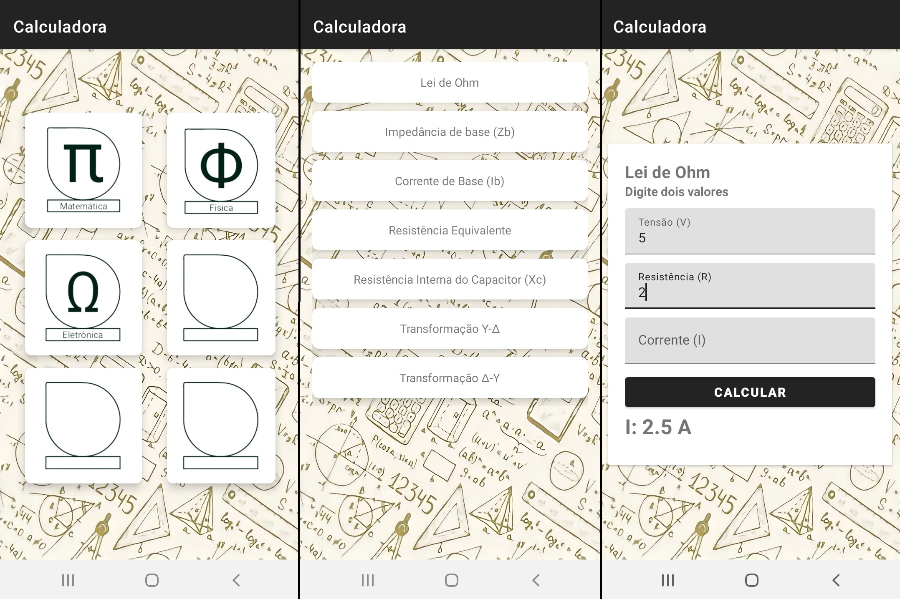

#  Project

Prototype of a calculator focusing on "Electrical Calculations". 

This application was created for a school project of "IFTM - Instituto Federal do Triângulo Mineiro".

[APK DOWNLOAD](https://github.com/wallacemod/Eletricalc/releases/tag/1.0)

## 💻 Technologies

- Java ([Android Studio](https://developer.android.com/studio))

## 🚀 Planned updates 

- Optimizations
- Switch project to RecyclerView  
- Add more calculations
- Organization and Legibility  

## 🐜 Bugs

- Dark Mode may cause some design issues
- Multiple clicks on "calculate" may generate a queue of warning messages